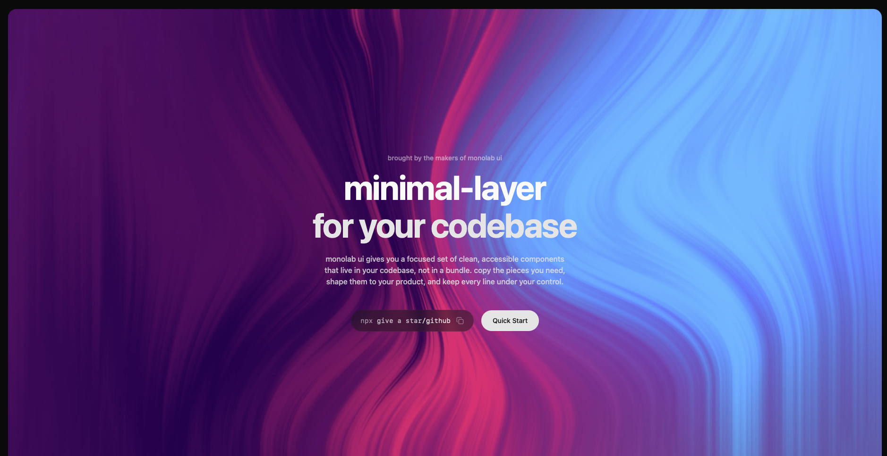
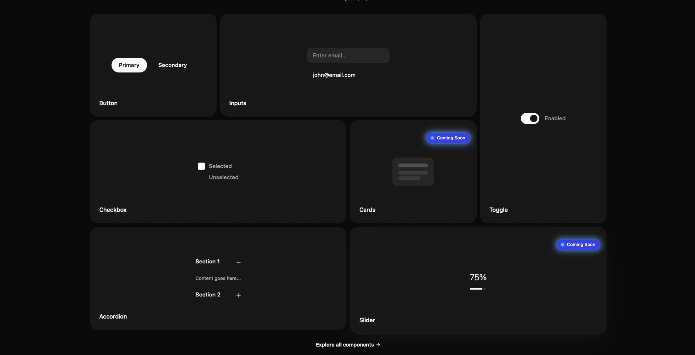

# MonoLab UI

<!-- Top visuals: place screenshots named `homepage.png` a
nd `components.png` in the `assets/` folder. -->
<!-- If you prefer, add them to `apps/web/public/` and update the paths below. -->

<p align="center">
	
</p>

<p align="center">
	
</p>

A documentation and demo site for the MonoLab UI component library and design system.

This repository is a monorepo (Turborepo) containing a Next.js frontend web app, docs site, and shared UI package. It's designed as a living component library and playground with interactive previews, component variants, and docs.

This README gives a complete quick-start for newcomers, explains the important files and folders, and documents platform integrations (PostHog) and developer workflows.

Table of contents

- About
- Quick start (local dev)
- Environment variables
- Project structure (what lives where)
- Key concepts (component registry, previews, variants)
- PostHog integration (what is tracked and how)
- Responsive / accessibility notes
- Common tasks and scripts
- Contributing
- Troubleshooting & FAQ

---

## About

MonoLab UI is a small component system built with React, TypeScript, Tailwind CSS and Next.js. The repo contains:

- `apps/web` — the primary demo/marketing site and component playground (Next.js App Router, TypeScript).
- `apps/docs` — documentation-focused Next.js app (if present in the monorepo).
- `packages/ui` or `@repo/ui` — shared React components used by the apps.
- `packages/*` — config packages like eslint/tsconfig used throughout the repo.

This repo follows a registry pattern where UI components register variants (preview + code string) into a central registry so the docs and component pages can render interactive previews and copyable code samples.

## Quick start (local development)

Prerequisites

- Node.js 18+ (recommended) and a package manager (npm, pnpm, or yarn).
- Git

1. Clone the repository

```bash
git clone <this-repo-url>
cd monolabui
```

2. Install dependencies

We use a monorepo workspace — install from the repo root. Example with npm:

```bash
# from repo root
npm install
# or pnpm install
# or yarn install
```

3. Start development

We typically run the `web` app while developing the UI. From repo root you can run the turbo dev script (if present) or start the app directly.

```bash
# start only the web app
cd apps/web
npm run dev

# or run turbo if configured to serve everything
cd <repo-root>
npx turbo dev
```

Open http://localhost:3000 (or the port printed in the terminal) to view the site.

## Environment variables

The web app expects a few environment variables for optional integrations. Create a `.env.local` in `apps/web` (or set env vars in your host) with the following keys when required:

Required for PostHog integration (optional):

```
NEXT_PUBLIC_POSTHOG_KEY=your_posthog_api_key
NEXT_PUBLIC_POSTHOG_HOST=https://app.posthog.com  # or your self-hosted PostHog host
```

Notes:

- `NEXT_PUBLIC_POSTHOG_KEY` and `NEXT_PUBLIC_POSTHOG_HOST` are only required if you want analytics testing locally. PostHog integration is guarded and will not break the app if missing.

## Project structure

High-level layout (abridged):

```
apps/
	web/                # main Next.js app (component playground + docs)
		app/
			page.tsx
			layout.tsx       # wraps app with ThemeProvider, PostHog provider
		components/        # shared UI used in the site (Navbar, Hero, etc.)
		lib/componentsRegistry/variants/  # per-component variant definitions
packages/
	eslint-config/
	typescript-config/
	ui/                 # shared component library (if present)

README.md
```

Key files to know

- `apps/web/app/layout.tsx`: application root — includes `ThemeProvider` and `PostHogProvider`.
- `apps/web/app/providers.tsx`: initializes PostHog and exports `PostHogProvider` used in `layout.tsx`.
- `apps/web/lib/componentsRegistry/*`: variant files (e.g., `inputs.tsx`, `accordion.tsx`) export arrays of variants that the registry uses.
- `apps/web/components/ComponentPreviews/*`: client preview helpers (interactive examples) used by variants.
- `apps/web/components/Hero/Hero.tsx` and `BackgroundVideo.tsx`: hero section and background media behaviour.

## Key concepts

1. Component registry

The docs and components pages use a registry that lists all UI components and their `variants`. Each variant is an object with:

- `id` — a unique id for the variant
- `name` — human-friendly name
- `preview` — a React node (often a client component) rendered in the docs
- `code` — a string with an example usage that can be copied by users

When adding a new component:

- Add its preview components to `components/ComponentPreviews` for interactive examples.
- Add its variants (preview + code) to `lib/componentsRegistry/variants/<component>.tsx` and export them.
- Ensure the central registry imports and assigns the variants array so the UI shows it.

2. Client previews and interaction

Previews that require interactivity must be React client components (use "use client" at the top). Keep state localized to previews so docs remain server-renderable.

3. Landing / Component listing and ComingSoon badge

Landing and /components listing compute a `hasVariants` predicate. If a component has variants (an array), the ComingSoon badge is not shown. When adding variants, ensure the registry entry contains `variants: <array>`.

## PostHog integration (analytics)

This project includes optional PostHog analytics wired in `apps/web/app/providers.tsx` (see the `PostHogProvider`):

- `apps/web/app/providers.tsx` — initializes `posthog-js` with `NEXT_PUBLIC_POSTHOG_KEY` and `NEXT_PUBLIC_POSTHOG_HOST` and wraps children in `PHProvider` from `posthog-js/react`.
- `apps/web/components/Posthog/AutoCapture.tsx` — a lightweight client component that captures `page_auto_capture` events for specific routes (docs, components and the home #components hash). This is enabled inside the PostHog provider and will only run on the client.
- `apps/web/components/Posthog/CheckoutButton.tsx` — example client component that demonstrates `usePostHog()` and `posthog.capture('purchase_completed', { amount })`.

What is tracked by default with the current setup

- `page_auto_capture` events are sent when a user visits or navigates to:
  - `/docs` and any `/docs/*` pages (includes Quick Start)
  - `/components` and any `/components/*` pages
  - `/` when the location hash includes `#components`
- The Checkout button demo emits `purchase_completed` when clicked.

If you want richer automatic capture (clicks/forms/pageviews), enable the PostHog options in `providers.tsx` by adding `autocapture: true` and/or `capture_pageview: true` to `posthog.init(...)`.

## Responsive & accessibility notes

- The demo uses Tailwind CSS utilities and attempts to be responsive by default. There are helper classes and small global rules (`img, video, iframe { max-width: 100%; height: auto; }`) to prevent overflow.
- Interactive previews that require client state are marked with `"use client"` and scoped to the preview folder.
- When updating layouts, prefer utility classes like `px-4 sm:px-6 lg:px-8` to add responsive containers without breaking larger layouts.

## Common tasks & scripts

From the `apps/web` folder the common scripts are:

- `npm run dev` — start Next.js dev server (port 3000 by default)
- `npm run build` — build the site for production
- `npm run start` — start Next.js production server (after build)
- `npm run lint` — run ESLint
- `npm run check-types` — run TypeScript checks

At the repo root you may have `turbo` tasks to run or build all packages.

## Contributing

If you'd like to contribute:

1. Fork the repo and create a feature branch.
2. Add or update variants and previews as needed. Keep previews isolated and client-only when they require interactivity.
3. Run `npm run lint` and `npm run check-types` in `apps/web` before opening a PR.
4. Create a PR describing your changes and which components/pages you updated.

Guidelines

- Keep public API stable: prefer additive changes to exported components.
- Add tests for complex logic where practical.
- Keep snapshots / examples in the docs updated when visuals change.

## Troubleshooting & FAQ

Q: I edited `lib/componentsRegistry/variants/inputs.tsx` and now the build fails with parse errors
A: Ensure the file contains valid TSX. Variant `code` fields must be valid JavaScript template strings (use backticks) and must not contain stray Markdown fences (```tsx). Previews that are JSX nodes must not leak into those strings. If you need interactive previews, import a client component and reference it from the `preview`field (keep`code` as a string).

Q: Analytics events are not visible in PostHog
A: Ensure `NEXT_PUBLIC_POSTHOG_KEY` and `NEXT_PUBLIC_POSTHOG_HOST` are set. In Chrome DevTools look for network requests to the host (path `/e/`). In PostHog, check Live events.

## FAQ / notes

- Where are component variants defined? — `apps/web/lib/componentsRegistry/variants/*.tsx`.
- Why is something showing a ComingSoon badge? — The page determines `hasVariants` by checking that `component.variants` is an array and has length > 0. Make sure `variants` is set and exported from the registry.
- How do interactive previews work? — Previews that need state are client components (use "use client") and are imported into the variant file. The `preview` prop of a variant is a React node which the registry renders inside the docs.

## License

This repository does not include a license file by default. Add a LICENSE file if you intend to make this project open-source.

## Credits

This project draws inspiration and patterns from shadcn/ui, Turborepo examples, and other community component libraries.
